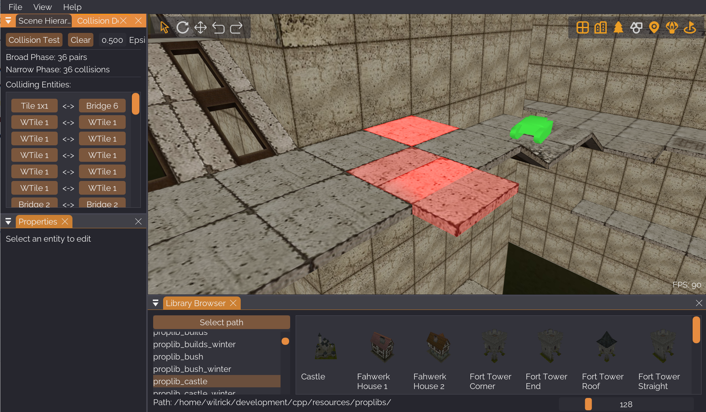

# Tanki Map Editor

A 3D map editor for creating Tanki Online maps, built from scratch with C++ and OpenGL.

## Features

**3D Editing**
- Intuitive viewport with WASD camera controls
- Transform gizmos for move, rotate, and scale operations
- Grid snapping for precise placement
- Multi-selection with rectangle select and modifier keys
- Group rotation for batch transformations

**Asset Management**
- Library browser with prop previews
- Multiple texture variants per prop
- Skybox support with custom library format
- Graceful handling of missing assets during import

**Game Elements**
- Spawn points, CTF flags, and domination points
- Bonus regions for power-ups

**Workflow**
- Full undo/redo history
- XML import/export (Tanki map format)
- Overlap detection to catch placement errors

## Quick Start

### Get Assets

Download prop libraries and maps from:
- [tanki-prop-libraries](https://github.com/MapMakersAndProgrammers/tanki-prop-libraries)
- [tanki-xml-maps](https://github.com/MapMakersAndProgrammers/tanki-xml-maps)

### Load & Edit

1. Click **Select path** in Library Browser and choose your prop libraries directory
2. Go to **File → Import Map** to load an existing `.xml` map
3. Drag and drop assets straight into the viewport
4. Right-click objects to select, hold `Shift` for multi-select

## Controls

| Action | Key |
|--------|-----|
| **Camera** | |
| Move | `W` `A` `S` `D` |
| Up / Down | `Q` / `E` |
| Rotate | Left-click + drag |
| Speed boost | Hold `Shift` |
| **Editing** | |
| Select mode | `V` |
| Translate mode | `T` |
| Rotate mode | `R` |
| Quick rotate 90° | `Z` / `X` |
| Move selection | Arrow keys |
| Move selection up/down | `Page Up` / `Page Down` |
| Duplicate | `Space` |
| Delete | `Delete` |
| Deselect | `Esc` |
| **Grid** | |
| Select grid | `G` |
| Adjust grid height | `Page Up` / `Page Down` (with grid selected) |
| **Selection** | |
| Multi-select | `Shift` + right-click |
| Rectangle select | `Ctrl` + right-click drag |
| Add to selection | `Ctrl` + `Shift` + right-click drag |
| Select library | `Ctrl` + `P` |
| **History** | |
| Undo | `Ctrl` + `Z` |
| Redo | `Ctrl` + `Y` |

### Grid & Snapping

Assets dropped into the viewport automatically snap to the grid height.

- **Gizmo snapping**: Hold `Ctrl` while dragging (250 units XZ, 300 units Y)
- **Arrow keys / Page Up/Down**: Move selection in snapped increments; hold `Ctrl` for half snap size
- **Properties panel**: `Shift` for larger increments, `Alt` for smaller, `Ctrl` + click for exact values

## Additional Resources

- See `manual/` for the full hotkey reference
- See `skyboxes/` for the skybox library format example
